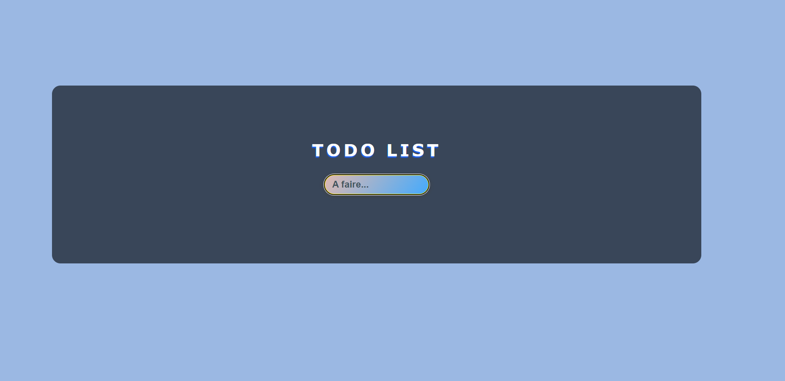
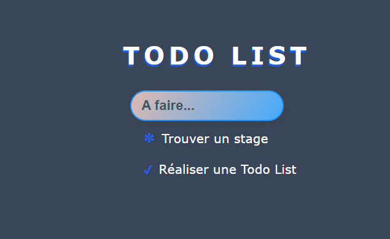

# Todo List - TP JavaScript


This project is a simple Todo List application created as part of a JavaScript practice exercise. The goal is to allow users to manage a task list with features like adding, deleting, and marking tasks as completed.

### Features:
- Add a task.
- Delete a task.
- Mark a task as completed (and unmark it if necessary).
- Dynamically updated list in real-time.


## Screenshots





## Code Exemple
```javascript
function storeList() {
  window.localStorage.todoList = list.innerHTML;
}

function getTodos() {
  if (window.localStorage.todoList) {
    list.innerHTML = window.localStorage.todoList;
  } else {
    list.innerHTML = "";
  }
}

window.addEventListener("load", getTodos);

//  add element
form.addEventListener("submit", (e) => {
  e.preventDefault();
  list.innerHTML += `<li>${item.value}</li>`;
  item.value = "";
  storeList();
})

//  remove element
list.addEventListener("click", (e) => {
  if (e.target.classList.contains("checked")) {
    e.target.remove();
  } else {
    e.target.classList.add("checked");
  }
  storeList();
})
```
## Languages

HTML
CSS
Javascript

## License

[MIT](https://choosealicense.com/licenses/mit/)

